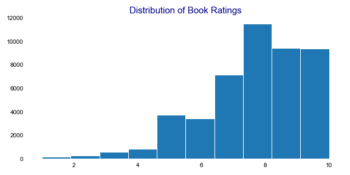
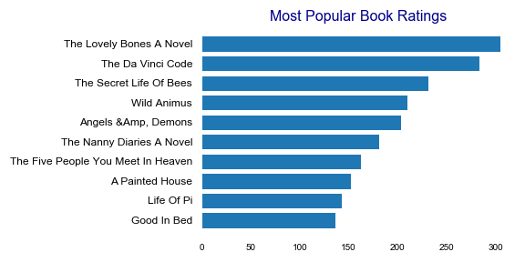
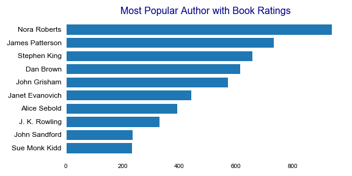
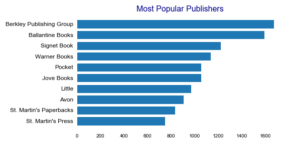

# Objective
- Build a book recommendation system to improve customer expereince and buying power.  

# Problem 
We are trying to improve Barnes and Nobles customer experience. Given previous user ratings we would like to improve 3 topics:
1. existing user recommendations 
2. new user recommendations 
3. an item to item recommendation 

Recommendation system with books scraped from bookcrossing.com. For full presentation on book recommendation please visit https://docs.google.com/presentation/d/1ytR5aZQs46Kec9FpAQGRL0nTdByg57v1QToAy5jGoKE/edit#slide=id.p

# Book and User Evaluations

In the graph below you can see that the ratings  are on a scale from 1-10. More books are rated between 7-10. 

The graph below shows the top rated books, authors, and publishers based on user rating count. 

The final evaluation graph shows a distribution of user states. 

